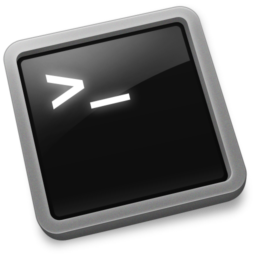

!SLIDE center transition=scrollUp

# Declaração de Variaveis

!SLIDE transition=scrollUp

# Criando Variaveis

Na execução de scripts é muito comum a passagem de parãmetros,  existem algumas formas de passar essas iformações através de variaveis;

Por exemplo, considere o script anterior, ao invés de listar o conteúdo do diretório pessoal do usuário poderiamos usar uma variável de forma que o script possa listar o conteúdo de um diretório qualquer;

Por exemplo:

    @@@shell
    #!/bin/bash
    #
    # Declarando uma variavel:
    cd
    clear
    ls $1

.download second-one.sh

!SLIDE commandline incremental transition=scrollUp

# Criando Variaveis

Crie o arquivo [second-one.sh](https://raw.githubusercontent.com/fiap2trc/Scripts/master/files/second-one.sh), após sua criação execute conforme abaixo:

	$ chmod +x second-one.sh
	$ bash second-one.sh
	
	Execute novamente passando um diretório a frente do nome do script:
	$ bash second-one.sh /etc

.callout.info `Nesse exemplo utilizamos a variável $1 para "resgatar" o primeiro valor passado na execução do script`
